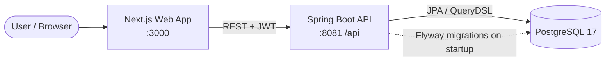

<div align="center">

# Kakebo

A personal finance manager inspired by the Japanese *kakebo* budgeting method — a mindful way to record income, plan spending, and reflect on where your money goes.


<br/>


<br/>
[](https://github.com/Welpeth/financier-kakebo/actions/workflows/CI.yml)
[](LICENSE.md)

</div>

---

## Overview

Kakebo is a full-stack application for keeping personal finances under control. It follows the spirit of the traditional *kakebo* (家計簿, "household ledger"): instead of just tracking numbers, it encourages organizing money into journals and categories so spending becomes intentional and easy to review.

The product is split into two applications that talk to each other over HTTP. A **Next.js** web client provides the interface, and a **Spring Boot** API owns the business rules, authentication, and persistence. A user (a *Holder*) signs in and works with a small set of connected domain concepts:

- **Journals** group financial activity, each holding its own **Categories**.
- **Accounts** (checking / savings) and **Account Cards** (credit / debit) represent where money lives and how it moves.
- **Transactions** (cash, debit, credit, PIX) record individual movements, optionally split into **Installments** through an **Installment Purchase**.
- **Ledger Entries** tie transactions back to a journal so balances and history stay consistent.
- **Subscriptions** model recurring charges, and **Notifications** surface things like upcoming due dates.

The frontend never touches the database directly — every read and write goes through the authenticated API, which validates requests and keeps the schema versioned with Flyway.

## Architecture



Requests from the browser hit the Next.js app, which calls the Spring Boot API at `/api`. The API authenticates each request with a JWT (stateless sessions), runs the business logic, and persists data to PostgreSQL through JPA and QueryDSL. On startup, Flyway applies any pending migrations and the schema is validated against the entities.

## Tech stack

**Frontend**
- Next.js 15 (App Router, standalone output) with React 19
- TypeScript and TailwindCSS v4
- axios for API calls, lucide-react for icons

**Backend**
- Spring Boot 4 on Java 21
- Spring Security with JWT (jjwt) for stateless auth
- Spring Data JPA + QueryDSL over PostgreSQL 17
- Flyway for versioned database migrations
- Spring Boot Actuator for health and readiness/liveness probes

**Infrastructure & tooling**
- Docker multi-stage builds for both apps, orchestrated with Docker Compose
- GitHub Actions for CI (build, test, SonarCloud, CodeQL)
- Maven (with wrapper) for the backend, npm for the frontend

## Project structure

```
kakebo/
├── backend/
│   └── financier/            Spring Boot API (Maven)
│       ├── src/main/java      domain, config, base, util
│       ├── src/main/resources application.properties, db/migration (Flyway)
│       ├── Dockerfile         multi-stage build (Maven -> JRE 21)
│       ├── compose.yaml       local dev services (Postgres + SonarQube)
│       └── .env.example       environment variables template
├── frontend/                 Next.js web app
│   ├── src/                   pages, components, models
│   └── Dockerfile            multi-stage build (standalone output)
├── compose.full.yaml         full stack: Postgres + backend + frontend
└── .github/workflows/        CI and security analysis
```

## Getting started

### Prerequisites

- **Docker** and **Docker Compose** (recommended path), or
- **Java 21** and **Node 20+** for running each app locally.

### Run the full stack with Docker (recommended)

From the repository root:

```bash
# 1. Provide environment variables (defaults work out of the box)
cp backend/financier/.env.example backend/financier/.env

# 2. Build and start Postgres, the backend, and the frontend
docker compose -f compose.full.yaml up --build
```

Once the containers report healthy:

| Service   | URL                                         |
|-----------|---------------------------------------------|
| Frontend  | http://localhost:3000                       |
| API       | http://localhost:8081/api                   |
| Health    | http://localhost:8081/api/actuator/health   |

The frontend waits for the backend to become healthy before starting, and the backend waits for PostgreSQL — so a single command brings up a consistent stack.

### Local development

Run the two apps separately for hot reloading.

**Backend** (`backend/financier`):

```bash
cp .env.example .env          # set DB credentials and JWT_SECRET
./mvnw spring-boot:run        # starts the API on :8081
```

Spring Boot's Docker Compose integration starts the local development services (PostgreSQL) automatically. The API expects a reachable database and a `JWT_SECRET`.

**Frontend** (`frontend`):

```bash
npm install
npm run dev                   # starts the web app on :3000
```

Set `NEXT_PUBLIC_API_URL` (defaults to `http://localhost:8081/api`) so the client points at your running API.

## Configuration

Environment variables are read from `.env` (or the host environment). Defaults are suitable for local use only — always override `JWT_SECRET` in production.

| Variable              | Default                              | Purpose                                  |
|-----------------------|--------------------------------------|------------------------------------------|
| `DB_USERNAME`         | `postgres`                           | Database user                            |
| `DB_PASSWORD`         | `admin`                              | Database password                        |
| `DB_NAME`             | `postgres`                           | Database name                            |
| `DB_URL`              | `jdbc:postgresql://localhost:5432/postgres` | JDBC connection string            |
| `JWT_SECRET`          | _(none)_                             | Signing key for JWTs (set a strong value)|
| `JWT_EXPIRATION`      | `86400000`                           | Token lifetime in milliseconds           |
| `NEXT_PUBLIC_API_URL` | `http://localhost:8081/api`          | API base URL baked into the frontend     |

## Health & observability

The backend exposes Spring Boot Actuator health endpoints (public, the rest of the API requires a JWT):

- `GET /api/actuator/health` — overall status
- `GET /api/actuator/health/liveness` — process is up
- `GET /api/actuator/health/readiness` — ready to serve traffic

The backend container ships a `HEALTHCHECK` that polls the health endpoint, which Docker Compose uses to gate the startup order.

## Database migrations

Schema changes are managed by **Flyway**. Versioned scripts live in `backend/financier/src/main/resources/db/migration` (`V1__...` through the latest), and are applied automatically when the backend starts. JPA runs with `ddl-auto=validate`, so the entities are checked against the migrated schema rather than generating it.

## Quality & CI

Every push and pull request to `main` runs GitHub Actions:

- **Build & Test** — Maven `verify` against a real PostgreSQL service container, with optional SonarCloud analysis and JaCoCo coverage.
- **CodeQL** — static security analysis for Java and JavaScript/TypeScript.

Run the backend test suite locally with:

```bash
cd backend/financier
./mvnw verify
```

## License

Distributed under the **Commercial Restriction License (CRL-1.1)**. See [LICENSE.md](LICENSE.md). Copyright © 2026 Henrique José Dias Pereira.
